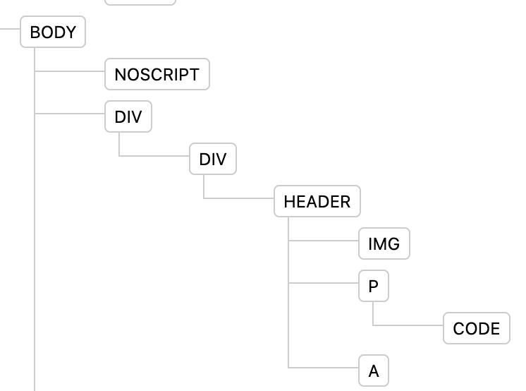

# DOM and Virtual DOM

React maintains a tree of React components that it renders to the DOM via a reconciliation algorithm. Let's take a look at how react achieves this through this lesson.

Extra Reading : https://reactjs.org/docs/reconciliation.html

